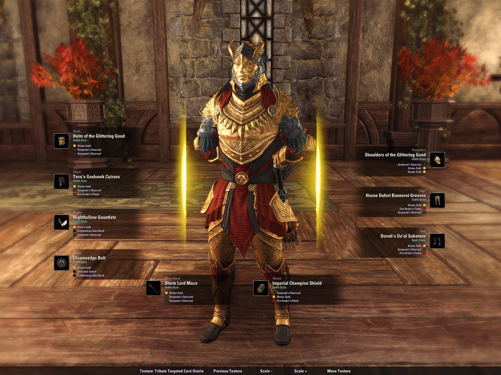

## Mementos

While Vestige Mirror is open, use **Play Memento** on the bottom bar. It opens a vertical, scrollable list above the button containing every unlocked memento available to the current character.

Selecting a memento briefly suspends character framing, invokes ESO's public collectible API, and then restores the mirror camera and outfit preview. Mementos are genuinely used and therefore observe their normal cooldown and zone restrictions.
